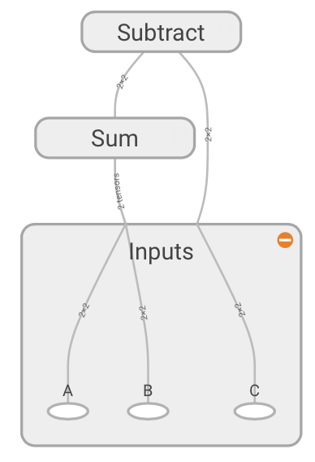

# Introduction to TensorFlow

Hackathon 2018

---

## What is Tensorflow?

- Software library for numerical computation 

- _... but wait, why not just use Numpy?_ |

---

## Tensorflow vs Numpy

**Numpy**: expensive computations are done outside of python with very efficient code. 

_Problem_: overhead for switching in and out of python for every operation. 

**Tensorflow**: avoids this overhead by using sets of interacting operations that can be run all outside of python.

---

## Data flow graphs

Representations of the data dependencies between a number of operations.



---

## The basics

There are two main parts to a Tensorflow program:

1. Building the graph
2. Running the graph

---

## Building the graph

* Use "placeholders" for where the data will come in
* Build the operations

```python
import tensorflow as tf

graph = tf.Graph()
with graph.as_default():
    a = tf.placeholder(dtype=tf.int32, shape=[1])
    b = tf.placeholder(dtype=tf.int32, shape=[1])
    sum_ab = tf.add(a, b)
``` 
---

## Running the graph

Let the data flow through the graph

```python
with tf.Session(graph=graph) as sess:
    result = sess.run(sum_ab, feed_dict={a:[1], b:[2]})
```

---

## Going through each line

```python
init = tf.global_variables_initializer()
```

When one creates a variable, it is added to the "GLOBAL_VARIABLES" collection. The function global_variables_initializer() iterates through the variables in this collection and calls their initialiser. 

All the Variables of a graph need to be initialised. 

---

## Going through each line

```python
graph = tf.Graph()
with graph.as_default():
```
This specifies the graph that you are building. These two lines are not strictly necessary in this case because we only have one graph, and tensorflow assigns all operations to a default graph if you don't specify one. In this case, our graph contains two placeholders and their sum.

---

## Going through each line

```python
with tf.Session(graph=graph) as sess:
```
In order to run the graph, we need to create a session. This is a confusing concept when you first encounter tensorflow. The graph on its own does nothing, it's basically just a route map of where the data needs to go. Things are only computed within the session.

```python
result = sess.run(sum_ab, feed_dict={a:[1], b:[2]})
```

To obtain the result, you need to feed some data to the graph. In this case, we can feed the numbers "1" and "2" and obtain their sum as a result.  

---

## Linear regression

Now that we know the basics of how to build a graph and run it in a session, we are going to go through a slightly harder example.

Linear regression!

---

## A tf.Variable

```python
theta0 = tf.Variable(np.random.randn(), name='theta0')
```
This line creates a variable in the graph with the name 'theta0'. A variable is a tensor whose shape can be modified by running operations on it. So in this case, the slope and the intercept of the line are variables because we want to modify them until we find the best value possible.

---

## Optimiser

```python
optimiser = tf.train.GradientDescentOptimizer(learning_rate).minimize(cost_function)
```

